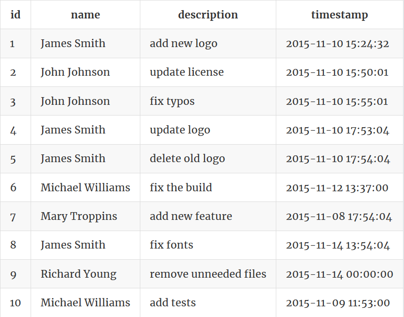
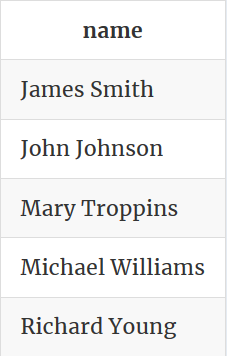

You've been promoted and assigned to a new project. The problem is, you don't know who you are working with and your predecessor has vanished without a trace! Luckily, each project in your company keeps its own activity database, which you are going to use to find out the names of your new colleagues.

Information about the project's activity is stored in table projectLog, which has the following structure:

id: unique action id;  
name: the name of the person who performed the action;  
description: the description of the action;  
timestamp: the timestamp of the action.  

You only have access to the project's most recent history, but this should be enough for you. You've decided that finding everyone who interacted with the project in this period is the best way to start.

Given the table projectLog, build a new results table with a single name column that contains the names of the project's contributors sorted in ascending order.

Example

For the following table projectLog



the output should be



```sql
/*Please add ; after each select statement*/
CREATE PROCEDURE projectsTeam()
BEGIN
    SELECT DISTINCT name
    FROM projectLog
    ORDER BY name;
END
```