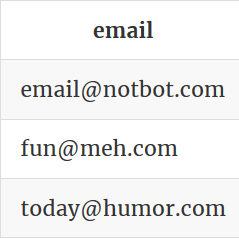

Implement the missing code, denoted by ellipses. You may not modify the pre-existing code.

The application you've been working on for the past year is a huge success! It already has a large and active user community. You know the ID number, username, and email of each user. Each user also has a specific role that shows their position in the community. Information about the users is stored in the database as a table users, which has the following structure:

id: the unique user ID;  
username: the username of the user;  
role the user's role;  
email: the user's email.

You want to send users automatic notifications to let them know about the most recent updates. However, not all users should get these notifications: Administrators don't need notifications since they know about the updates already, and premium users don't need them since they get personalized weekly updates.

Given the users table, your task is to return the emails of all the users who should get notifications, i.e. those whose role is not equal to "admin" or "premium". Note that roles are case insensitive, so users with roles of "Admin", "pReMiUm", etc. should also be excluded.

The resulting table should contain a single email column and be sorted by emails in ascending order.

Example

For the following table users


the resulting table should be


The only three users who should get notifications are luckygirl, todayhumor, and solver100500. Their emails are fun@meh.com, today@humor.com, and email@notbot.com respectively, which should be sorted as email@notbot.com, fun@meh.com, and today@humor.com.

```sql
CREATE PROCEDURE automaticNotifications()
    SELECT email
    FROM users
    WHERE role NOT IN ("admin", "premium")

    ORDER BY email;
```