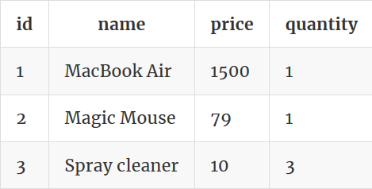
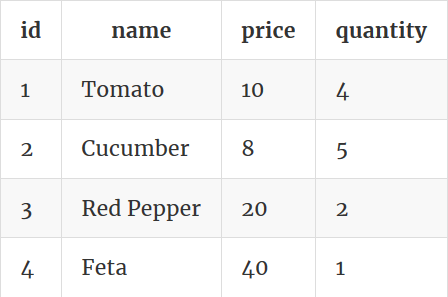
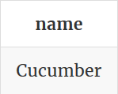

Mr. Cash wants to keep track of his expenses, so he has prepared a list of all the products he bought this month. Now he is interested in finding the product on which he spent the largest amount of money. If there are products that cost the same amount of money, he'd like to find the one with the lexicographically smallest name.

The list of expenses is stored in a table Products which has the following columns:

id: unique product id;
name: the unique name of the product;
price: the price for one item;
quantity: the number of items bought.

The resulting table should contain one row with a single column: the product with the lexicographically smallest name on which Mr. Cash spent the largest amount of money.

The total amount of money spent on a product is calculated as price * quantity.

Example

For the following table Products



the output should be


For the following table Products

the output should be

While the total cost for each product was 40, Cucumber has the lexicographically smallest name.

```sql
/*Please add ; after each select statement*/
CREATE PROCEDURE mostExpensive()
BEGIN
    SELECT name
    FROM Products
    ORDER BY price * quantity DESC, name
    LIMIT 1;
END
```


