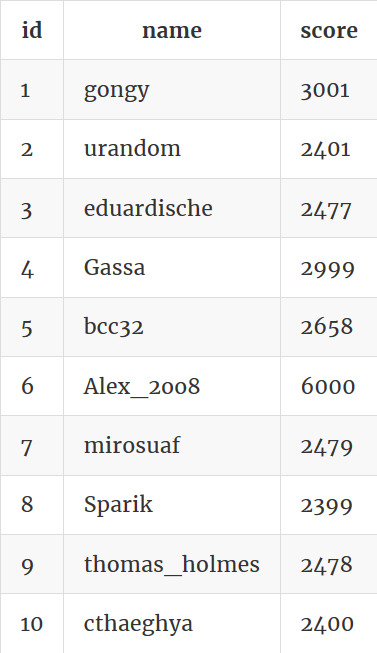
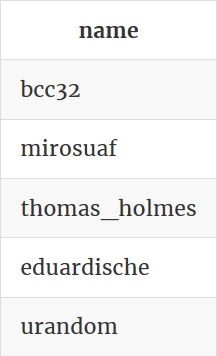

You are working as a recruiter at a big IT company, and you're actively looking for candidates who take the top places in major programming contests. Since the grand finale of the annual City Competition, you've been reaching out to the top participants from the leaderboard, and successfully so.

You have already interviewed all the prize winners (the top 3 participants), but that's not enough right now. Your company needs more specialists, so now you would like to connect with the participants who took the next 5 places.

The contest leaderboard is stored in a table leaderboard with the following columns:

id: unique id of the participant;
name: the name of the participant;
score: the score the participant achieved in the competition.

The resulting table should contain the names of the participants who took the 4th to 8th places inclusive, sorted in descending order of their places. If there are fewer than 8 participants, the results should contain those who ranked lower than 3rd place.

It is guaranteed that there are at least 3 prize winners in the leaderboard and that all participants have different scores.

Example

For the following table leaderboard

the output should be

