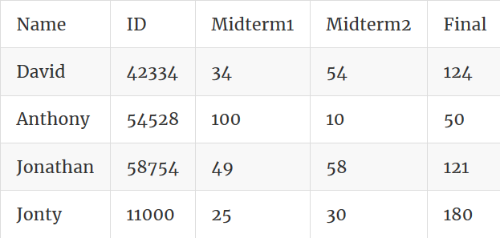

At the end of every semester your professor for "Introduction to Databases" saves the exam results of every student in a simple database system. In the database table Grades, there are five columns:

Name: the name of the student;
ID: the student's ID number (a 5 byte positive integer);
 Midterm1: the result of the first midterm out of 100 points;
Midterm2: the result of the second midterm out of 100 points;
Final: the result of the final exam, this time out of a possible 200 points.

According to school policy, there are three possible ways to evaluate a grade:

Option 1:
        Midterm 1: 25% of the grade
        Midterm 2: 25% of the grade
        Final exam: 50% of the grade
    Option 2:
        Midterm 1: 50% of the grade
        Midterm 2: 50% of the grade
    Option 3:
        Final exam: 100% of the grade.

Each student's final grade comes from the option that works the best for that student.

As a Teaching Assistant (TA), you need to query the name and id of all the students whose best grade comes from Option 3, sorted based on the first 3 characters of their name. If the first 3 characters of two names are the same, then the student with the lower ID value comes first.

Example

For the following table Grades  
  

Output should be  
  
For David, Jonty and Jonathan, the best option is number 3. But Anthony's best option is the second one, because Option1 = 25% of 100 + 25% of 10 +50% of 50 = 52.5, Option2 = 50% of 100 + 50% of 10 = 55, Option3 = 100% of 50 = 50.  
```sql
/*Please add ; after each select statement*/
CREATE PROCEDURE gradeDistribution()
BEGIN
    SELECT Name, ID FROM Grades
    WHERE (Midterm1 / 2 + Midterm2 / 2) < Final
--    WHERE (Midterm1 * 25% + Midterm2 * 25% + Final * 50%) < Final
--    AND (Midterm1 * 50% + Midterm2 * 50%) < Final
    ORDER BY SUBSTRING(Name, 1, 3), ID;
END
```