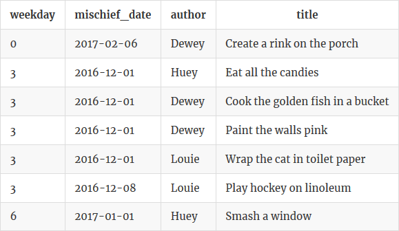

Your nephews Huey, Dewey, and Louie are staying with you over the winter holidays. Ever since they arrived, you've hardly had a day go by without some kind of incident - the little rascals do whatever they please! Actually, you're not even mad; the ideas they come up with are pretty amazing, and it looks like there's even a system to their mischief.

You decided to track and analyze their behavior, so you created the mischief table in your local database. The table has the following columns:

    mischief_date: the date of the mischief (of the date type);
    author: the nephew who caused the mischief ("Huey", "Dewey" or "Louie");
    title: the title of the mischief.

It looks like each of your nephews is active on a specific day of the week. You decide to check your theory by creating another table as follows:
The resulting table should contain four columns, weekday, mischief_date, author, and title, where weekday is the weekday of mischief_date (0 for Monday, 1 for Tuesday, and so on, with 6 for Sunday). The table should be sorted by the weekday column, and for each weekday Huey's mischief should go first, Dewey's should go next, and Louie's should go last. In case of a tie, mischief_date should be a tie-breaker. If there's still a tie, the record with the lexicographically smallest title should go first.

It is guaranteed that all entries of mischief are unique.

Example

For the following table mischief

the output should be

The first and the eighth of December are Thursdays, the sixth of February is a Monday, and the first of January is a Sunday.

The dates in the example are given in the format YYYY-MM-DD.

```sql
/*Please add ; after each select statement*/
CREATE PROCEDURE mischievousNephews()
BEGIN
    SELECT  WEEKDAY(mischief_date) AS weekday, mischief_date, author, title
    FROM mischief
    ORDER BY weekday, FIELD(author, 'Huey', 'Dewey', 'Louie'), mischief_date, title; 
-- mischief_date may not same when weekday is same  
END
```