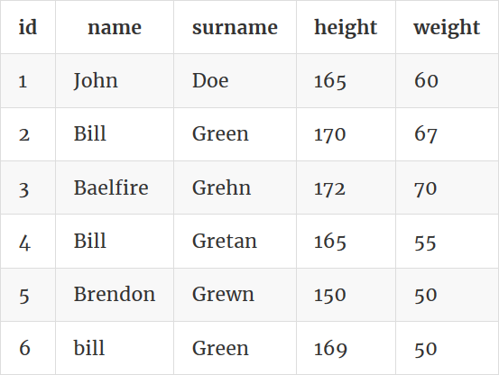
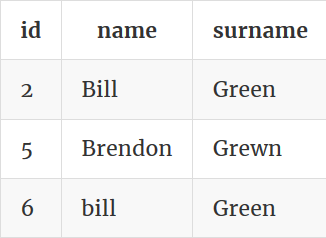

A large amount of money was stolen today from the main city bank, and as the chief of police it's your duty to find the robber.

You store information about your suspects in the table Suspect, which has the structure:

    id: unique suspect id;
    name: suspect first name;
    surname: suspect surname;
    height: suspect height;
    weight: suspect weight.

You have already gathered some evidence and discovered the following clues:

    according to the camera records, the robber is not taller than 170cm;
    the robber left their signature near the crime scene: "B. Gre?n". "B" definitely stands for the first letter of robber's name, and "Gre?n" is their surname. The 4th letter of the surname is smudged by ketchup and is unreadable.

To make the list of suspects smaller, you would like to filter out the suspects who can't possibly be guilty according to the information obtained from the clues. For each remaining suspect, you want to save his/her id, name and surname. Please note that the information obtained from the clue should be considered case-insensitive, so for example "bill Green", and "Bill green", and "Bill Green" should all be included in the new table.

Given the table Suspect, build the resulting table as follows: the table should have columns id, name and surname and its values should be ordered by the suspects' ids in ascending order.

Example

For the following table Suspect

the output should be
