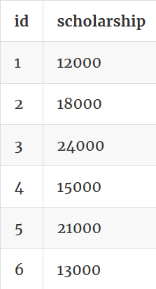
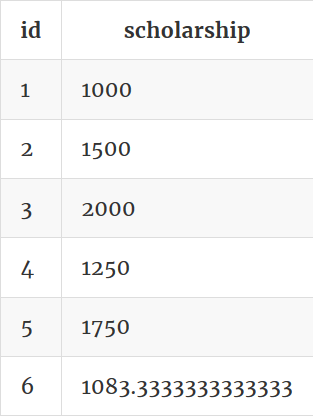

Students at your university get scholarships that are paid out throughout the year.

Information about the scholarships is stored in the table scholarships, which has the structure:

id: the unique student id;

scholarship: the amount of the annual scholarship the student has been awarded.

Now you need to calculate the amount of money each student should get per month. Given the table scholarships, build the resulting table as follows: The table should have the same columns as the initial table, but the scholarship column should contain the amount of the student's monthly scholarship payout. The rows should be ordered by the students' ids.

Example

For the following table scholarships

the output should be

